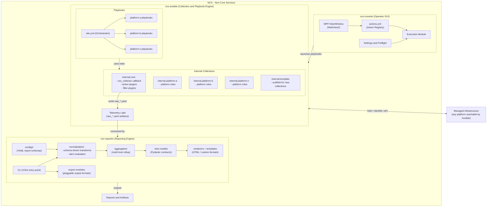

# NCS Architecture Diagram

## Component Summary

| Component | Role | Tech |
|---|---|---|
| **ncs-console** | Operator GUI — action launcher and preflight checks | PowerShell + WPF/WebView2 |
| **ncs-ansible** | Stage 1 — Collect. Runs platform roles via playbooks, emits structured `raw_*.yaml` telemetry via the `ncs_collector` callback | Ansible collections + playbooks |
| **ncs-reporter** | Stage 2 — Report. Schema-driven normalization, alerting, aggregation, and rendering into dashboards and export artifacts | Python CLI (Click + Pydantic) |

## Data Flow

1. **Console** selects an action from the registry and launches the corresponding Ansible playbook
2. **Ansible** connects to managed infrastructure over SSH / WinRM / platform APIs
3. Platform roles collect data; the **`ncs_collector`** callback persists results as `raw_*.yaml` artifacts
4. **Reporter** reads artifacts → normalizes via config-driven schemas → aggregates across hosts → renders reports and export artifacts
5. Output is written to a configurable report destination
