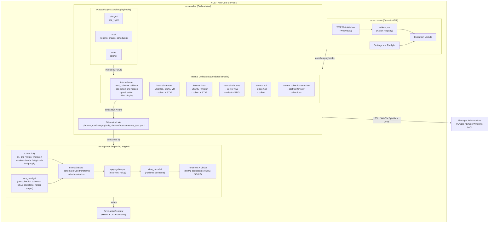

# NCS Architecture Diagram

## Components

| Component | Stage | Responsibility | Tech |
|---|---|---|---|
| **ncs-console** | Operator UI | Action registry (`actions.yml`), preflight checks, launches Ansible playbooks | PowerShell + WPF / WebView2 |
| **ncs-ansible** | Stage 1 — Collect | Orchestrates playbooks in `ncs-ansible/playbooks/` and five vendored `internal.*` collections; emits structured `raw_*.yaml` telemetry via the `ncs_collector` callback | Ansible collections + playbooks + `Justfile` |
| **ncs-reporter** | Stage 2 — Report | Schema-driven normalization, alert evaluation, multi-host aggregation, Pydantic view models, Jinja2 rendering into HTML dashboards / STIG reports / DISA CKLB artifacts | Python CLI (Click + Pydantic + Jinja2) |

## Built-in Collections

Each built-in collection is a tracked subdirectory of this repo with its own `galaxy.yml` release train. The orchestrator resolves them via `ncs-ansible/requirements.yml` (vendored tarballs by default, or live sibling-dir references in Mode B).

| Subdir | Collection | Purpose |
|---|---|---|
| `ncs-ansible-core/` | `internal.core` | `ncs_collector` callback, `stig` action + module, `pwsh` action, filter plugins — shared by every platform collection |
| `ncs-ansible-vmware/` | `internal.vmware` | vCenter, ESXi, VM collect + STIG audit / remediate |
| `ncs-ansible-linux/` | `internal.linux` | Ubuntu, Photon collect + STIG audit / remediate |
| `ncs-ansible-windows/` | `internal.windows` | Server + Active Directory collect + STIG audit / remediate |
| `ncs-ansible-aci/` | `internal.aci` | Cisco ACI collect |
| `ncs-ansible-collection-template/` | — | Scaffold for authoring third-party collections |

## Data Flow

1. **Console** selects an action from `actions.yml` and invokes the corresponding Ansible playbook (or the operator runs a `just` recipe directly from `ncs-ansible/`).
2. **Ansible** resolves the playbook — either `ncs-ansible/playbooks/site.yml` as an orchestrator, or a collection playbook by FQCN (`internal.vmware.esxi_stig_audit`, `internal.linux.ubuntu_collect`, `internal.windows.server_stig_audit`, etc.).
3. Collection roles connect to managed infrastructure over SSH / WinRM / platform APIs and run probes.
4. The **`ncs_collector`** callback in `internal.core` persists results to the telemetry lake as `raw_*.yaml` artifacts under `platform_root/category/sub_platform/hostname/`.
5. **Reporter** is invoked with `--config-dir ncs-ansible/ncs_configs` (whose `extra_config_dirs` fans out to every collection's `ncs_configs/`); it reads artifacts, normalizes through schemas, evaluates alerts, aggregates across hosts, builds Pydantic view models, and renders outputs.
6. Output lands under `/srv/samba/reports/` by default — HTML dashboards, per-host STIG reports, and DISA CKLB artifacts.

## Configuration Split

Operator-editable configuration lives in two places (see [`COLLECTION_LAYOUT.md`](COLLECTION_LAYOUT.md) for the full contract):

| Path | Scope |
|---|---|
| `ncs-ansible/ncs_configs/config.yaml` | Orchestrator index — lists each collection's `ncs_configs/` as an `extra_config_dir` |
| `ncs-ansible/ncs_configs/inventory_root.yaml` | Cross-platform inventory-root schema |
| `ncs-ansible/ncs_configs/schedules.yml` | Systemd timer definitions (consumed by `playbooks/ncs/manage_schedules.yml`) |
| `ncs-ansible-<name>/ncs_configs/*.yaml` | Platform-owned reporter schemas, CKLB skeletons, helper scripts — ships with the collection |

## Inventory and Vault Split

| World | Inventory | Vault | Use |
|---|---|---|---|
| Orchestrator (`ncs-ansible/`) | `inventory/production/` | `.vaultpass` | Production fleet; `just site`, scheduled collects, reporting |
| Collection (`ncs-ansible-<name>/`) | `tests/inventory/` (gitignored) | `tests/.vault_pass` (gitignored) | Standalone collection development via `cd ncs-ansible-<name> && just test` |

The two worlds never read from each other — collection `tests/` is invisible to orchestrator runs, and orchestrator inventory is invisible to `just test`.

## Two Ansible Environments

Both live under `ncs-ansible/`:

| Venv | Config | Use |
|---|---|---|
| `.venv/` | `ansible.cfg` | Everything except VCSA SSH — latest ansible-core |
| `.venv-vcsa/` | `ansible-vcsa.cfg` + `collections_vcsa/` | VCSA appliances — pinned to ansible-core 2.15 for Python 3.7 managed-node compatibility |
