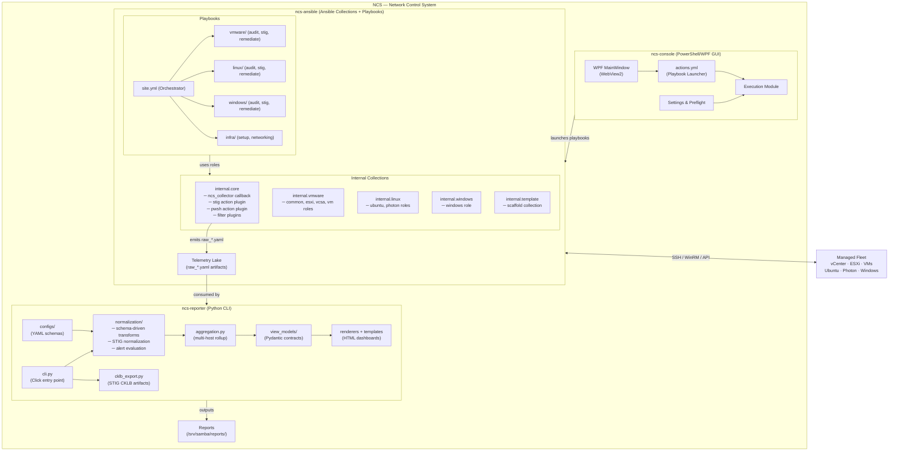

# NCS Architecture Diagram

## Component Summary

| Component | Role | Tech |
|---|---|---|
| **ncs-console** | Operator GUI — launches playbooks, shows results | PowerShell + WPF/WebView2 |
| **ncs-ansible** | Stage 1 — Collect. Runs audit/STIG/remediate roles, emits `raw_*.yaml` telemetry | Ansible collections + playbooks |
| **ncs-reporter** | Stage 2 — Report. Normalizes raw data, evaluates alerts, renders HTML dashboards & CKLB | Python CLI (Click + Pydantic) |

## Data Flow

1. **Console** triggers Ansible playbooks via `actions.yml`
2. **Ansible** connects to managed fleet over SSH / WinRM / vSphere API
3. **`ncs_collector`** callback writes `raw_*.yaml` artifacts to the telemetry lake
4. **Reporter** reads artifacts → normalizes → aggregates → renders HTML reports and CKLB files
5. Reports are written to `/srv/samba/reports/`
